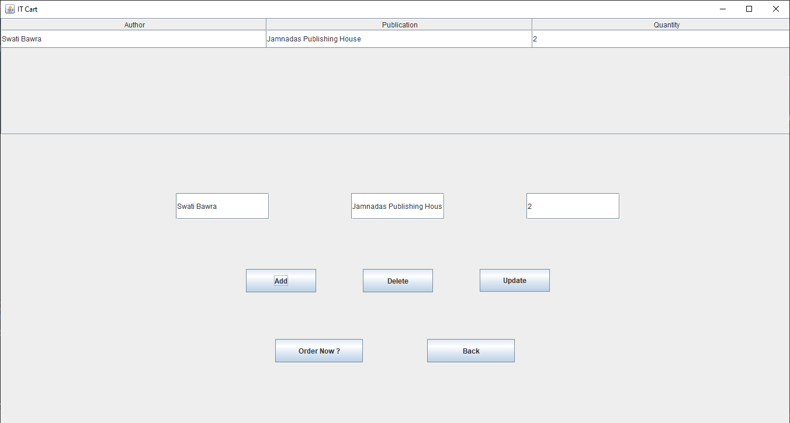
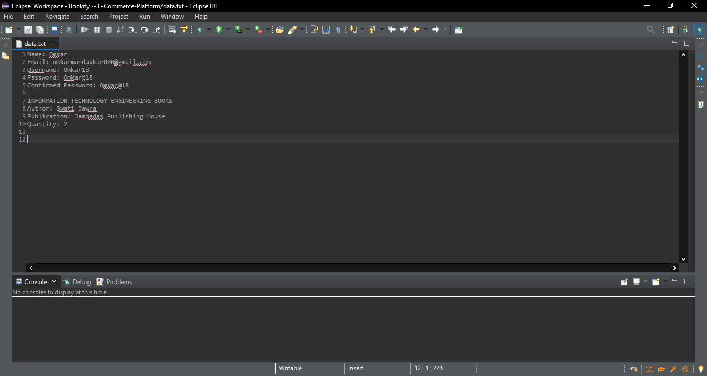

# **Bookify:** E-Commerce-Platform using Java 

This Project is made Using Java Swing for Engineering students, to save their time and energy from going out and searching the right book for Engineering Books from one shop to another.

## Features

- Get the Details of Engineering Books according to your syllabus
- Add your books to the cart 

## Tech Stack

**Programming**
- **Java**
- **Java Swing**
- **File Handling**

**IDE Used**
- **Eclipse** 

## Acknowledgements

 - [Javatpoint](https://www.javatpoint.com/)

## Execution

